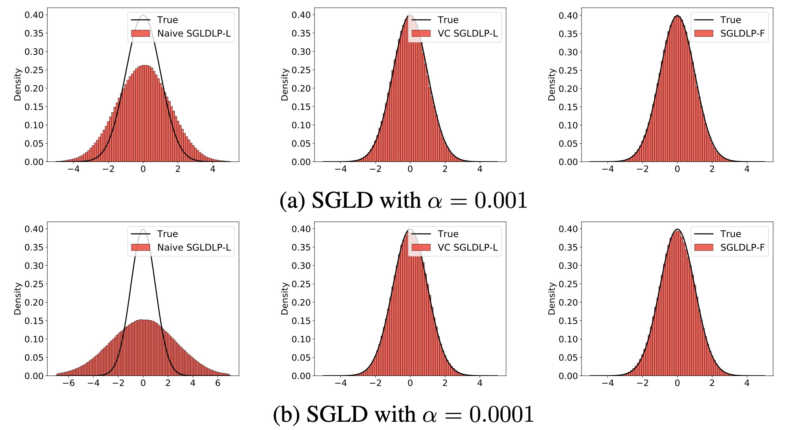

# Low-Precision Stochastic Gradient Langevin Dynamics

This repository contains code for the paper
[Low-Precision Stochastic Gradient Langevin Dynamics](arxiv link), accepted in _International Conference on Machine Learning (ICML), 2022_.

```bibtex
@article{zhang2022lpsgld,
  title={Low-Precision Stochastic Gradient Langevin Dynamics},
  author={Zhang, Ruqi and Wilson, Andrew Gordon and De Sa, Christopher},
  journal={International Conference on Machine Learning},
  year={2022}
}
```

# Introduction
While low-precision optimization has been widely used to accelerate deep learning, low-precision sampling remains largely unexplored. As a consequence, sampling is simply infeasible in many large-scale scenarios, despite providing remarkable benefits to generalization and uncertainty estimation for neural networks. In this paper, we provide the first study of low-precision Stochastic Gradient Langevin Dynamics (SGLD), showing that its costs can be significantly reduced without sacrificing the original performance due to its intrinsic ability to handle system noise. We prove that the convergence of low-precision SGLD with full-precision gradient accumulators is less affected by the quantization error than 
its SGD counterpart in the strongly convex setting. To further enable low-precision gradient accumulators, we develop a new quantization function for SGLD that preserves the variance in each update step. We demonstrate that low-precision SGLD is able to achieve comparable performance to full-precision SGLD with only 8 bits on a variety of deep learning tasks.

<p align="center">
  
</p>

# Dependencies
* [PyTorch 1.9.0](http://pytorch.org/) 
* [torchvision 0.10.0](https://github.com/pytorch/vision/)
* [QPyTorch](https://github.com/Tiiiger/QPyTorch)

# Experimental Results
## Gaussian Density

To reproduce the results of SGLD on a standard Gaussian,
```
cd gaussian
python gaussian.py --quant_type=<QUANT_TYPE>
```
* ```QUANT_TYPE``` &mdash; Quantization type. \
                            ``f``: full-precision gradient accumulators; \
                            ``vc``: low-precision gradient accumulators with variance-corrected quantization; \
                            ``naive``: naive low-precision gradient accumulators


## CIFAR Datasets
The training script is ``bnn/train.py`` and the testing script is ``bnn/ens.py``. Following are examples to reproduce some results.

```
cd bnn
bash train_fixed.sh     # low-precision SGLD with full-precision gradient accumulators (SGLDLP-F) with 8-bit fixed point on CIFAR10
bash train_bfp.sh   # low-precision SGLD with variance-corrected low-precision gradient accumulators (VC SGLDLP-L) with 8-bit block floating point on CIFAR10
bash train_bfp_cyclic.sh # cyclical VC SGLDLP-L with 8-bit block floating point on CIFAR10
bash ens_fixed.sh # testing the ensemble of the collected samples with fixed point
bash ens_bfp.sh # testing the ensemble of the collected samples with block floating point
```


# References
* Models are adapted from https://github.com/kuangliu/pytorch-cifar